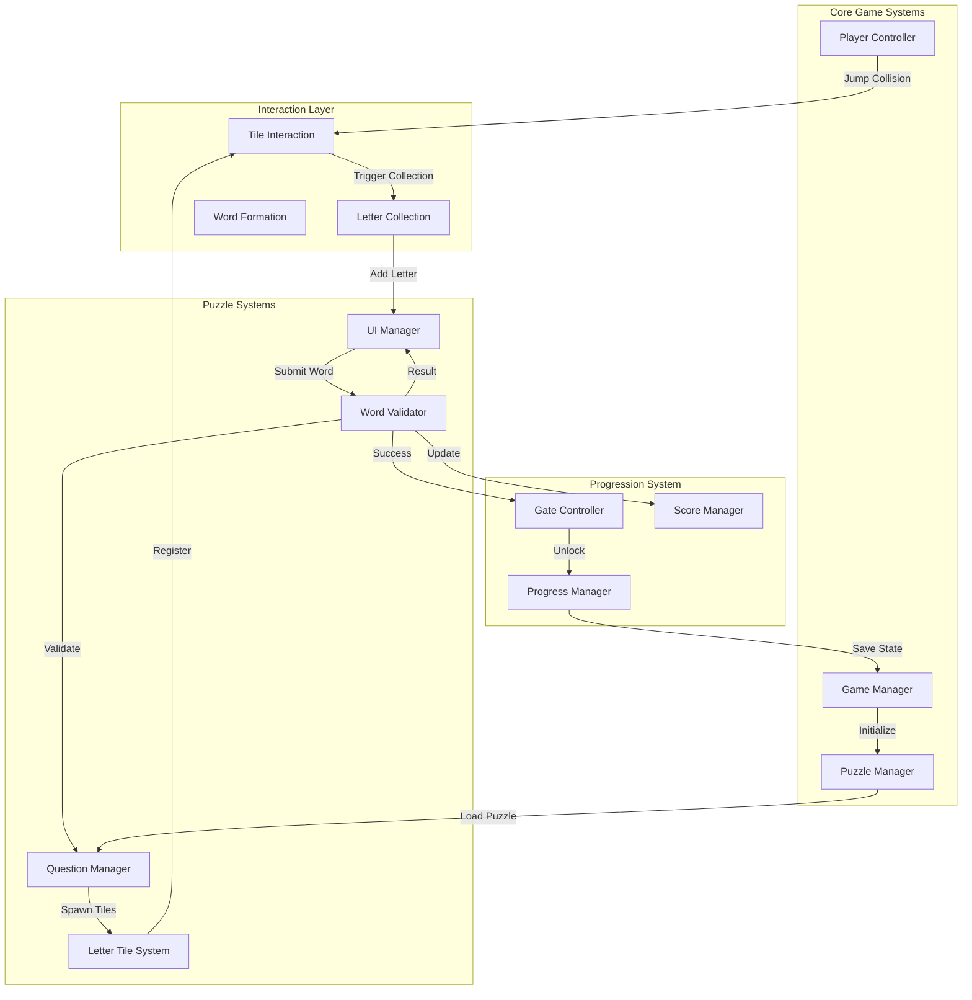
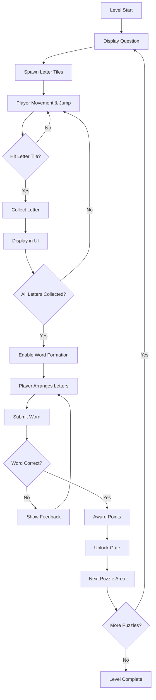
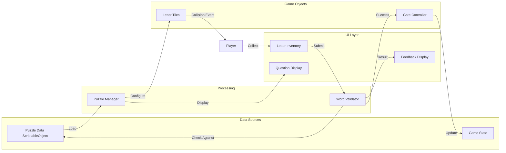
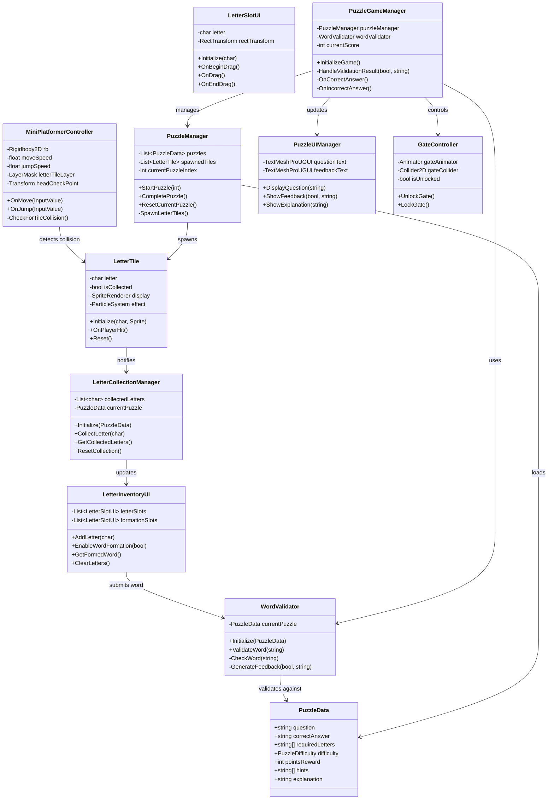

# Chemistry Word Puzzle Platformer - Technical Architecture Document

## Executive Summary

This document outlines the comprehensive technical architecture for a 2D platformer game with integrated chemistry-themed word puzzle mechanics. The design leverages the existing [`MiniPlatformerController`](../Assets/Scripts/MiniPlatformerController.cs:5) to create a Mario-inspired jumping mechanic where players hit letter tiles above their heads to collect letters and form chemistry-related words.

**Core Design Decisions:**

- Physical letter tiles as interactive game objects (Mario block style)
- Drag-and-drop UI for word formation
- Gate/door unlocking upon correct word completion
- Retry mechanism with feedback for incorrect attempts

---

## 1. System Architecture

### 1.1 High-Level Component Overview



### 1.2 Core Gameplay Loop



### 1.3 Data Flow Architecture



---

## 2. Detailed Component Design

### 2.1 Player Controller Integration

#### Enhanced MiniPlatformerController

The existing [`MiniPlatformerController`](../Assets/Scripts/MiniPlatformerController.cs:5) needs minimal modifications:

**Current Implementation Analysis:**

- Uses Unity's Input System for movement and jumping
- [`OnJump()`](../Assets/Scripts/MiniPlatformerController.cs:44) adds vertical velocity when jump is pressed
- No ground detection or collision handling for tiles

**Required Enhancements:**

```csharp
public class MiniPlatformerController : MonoBehaviour
{
    // Existing fields...
    [SerializeField] private LayerMask letterTileLayer;
    [SerializeField] private Transform headCheckPoint;
    [SerializeField] private float headCheckRadius = 0.2f;

    private PuzzleGameManager puzzleManager;

    void Start()
    {
        // Existing initialization...
        puzzleManager = FindObjectOfType<PuzzleGameManager>();
    }

    void OnJump(InputValue inputValue)
    {
        if (inputValue.isPressed)
        {
            rb.linearVelocity += new Vector2(0f, jumpSpeed);
            CheckForTileCollision(); // New method
        }
    }

    private void CheckForTileCollision()
    {
        Collider2D[] hitTiles = Physics2D.OverlapCircleAll(
            headCheckPoint.position,
            headCheckRadius,
            letterTileLayer
        );

        foreach (var tile in hitTiles)
        {
            LetterTile letterTile = tile.GetComponent<LetterTile>();
            if (letterTile != null && !letterTile.IsCollected)
            {
                letterTile.OnPlayerHit();
            }
        }
    }
}
```

**Integration Points:**

- Head collision detection using overlap sphere at jump apex
- Layer-based filtering for letter tiles
- Event-driven communication with tile system
- No modification to existing movement logic

---

### 2.2 Letter Tile System

#### LetterTile Component

```csharp
public class LetterTile : MonoBehaviour
{
    [Header("Tile Configuration")]
    [SerializeField] private char letter;
    [SerializeField] private SpriteRenderer letterDisplay;
    [SerializeField] private Sprite emptyTileSprite;
    [SerializeField] private Sprite activeTileSprite;

    [Header("Animation")]
    [SerializeField] private float bounceHeight = 0.3f;
    [SerializeField] private float bounceDuration = 0.2f;
    [SerializeField] private AnimationCurve bounceCurve;

    [Header("Effects")]
    [SerializeField] private ParticleSystem collectEffect;
    [SerializeField] private AudioClip collectSound;

    public char Letter => letter;
    public bool IsCollected { get; private set; }

    private Vector3 originalPosition;
    private LetterCollectionManager collectionManager;

    void Awake()
    {
        originalPosition = transform.position;
        collectionManager = FindObjectOfType<LetterCollectionManager>();
    }

    public void Initialize(char letterChar, Sprite activeSprite)
    {
        letter = letterChar;
        activeTileSprite = activeSprite;
        UpdateVisual();
    }

    public void OnPlayerHit()
    {
        if (IsCollected) return;

        IsCollected = true;
        PlayBounceAnimation();
        PlayCollectEffects();
        collectionManager.CollectLetter(letter);

        StartCoroutine(DisableAfterAnimation());
    }

    private void PlayBounceAnimation()
    {
        StartCoroutine(BounceRoutine());
    }

    private IEnumerator BounceRoutine()
    {
        float elapsed = 0f;

        while (elapsed < bounceDuration)
        {
            float progress = elapsed / bounceDuration;
            float bounceOffset = bounceCurve.Evaluate(progress) * bounceHeight;
            transform.position = originalPosition + Vector3.up * bounceOffset;

            elapsed += Time.deltaTime;
            yield return null;
        }

        transform.position = originalPosition;
    }

    private void PlayCollectEffects()
    {
        if (collectEffect != null)
            collectEffect.Play();

        if (collectSound != null)
            AudioSource.PlayClipAtPoint(collectSound, transform.position);
    }

    private IEnumerator DisableAfterAnimation()
    {
        yield return new WaitForSeconds(bounceDuration);
        letterDisplay.sprite = emptyTileSprite;
        GetComponent<BoxCollider2D>().enabled = false;
    }

    private void UpdateVisual()
    {
        if (letterDisplay != null)
        {
            letterDisplay.sprite = activeTileSprite;
        }
    }

    public void Reset()
    {
        IsCollected = false;
        transform.position = originalPosition;
        letterDisplay.sprite = activeTileSprite;
        GetComponent<BoxCollider2D>().enabled = true;
    }
}
```

#### Letter Collection Manager

```csharp
public class LetterCollectionManager : MonoBehaviour
{
    [Header("UI References")]
    [SerializeField] private LetterInventoryUI inventoryUI;

    private List<char> collectedLetters = new List<char>();
    private PuzzleData currentPuzzle;

    public event System.Action<char> OnLetterCollected;
    public event System.Action OnAllLettersCollected;

    public void Initialize(PuzzleData puzzle)
    {
        currentPuzzle = puzzle;
        collectedLetters.Clear();
    }

    public void CollectLetter(char letter)
    {
        collectedLetters.Add(letter);
        OnLetterCollected?.Invoke(letter);
        inventoryUI.AddLetter(letter);

        if (collectedLetters.Count >= currentPuzzle.RequiredLetters.Length)
        {
            OnAllLettersCollected?.Invoke();
            EnableWordFormation();
        }
    }

    private void EnableWordFormation()
    {
        inventoryUI.EnableWordFormation(true);
    }

    public List<char> GetCollectedLetters()
    {
        return new List<char>(collectedLetters);
    }

    public void ResetCollection()
    {
        collectedLetters.Clear();
        inventoryUI.ClearLetters();
    }
}
```

---

### 2.3 Word Validation System

#### WordValidator

```csharp
public class WordValidator : MonoBehaviour
{
    [Header("Validation Settings")]
    [SerializeField] private float validationDelay = 0.5f;
    [SerializeField] private bool caseSensitive = false;

    private PuzzleData currentPuzzle;

    public event System.Action<bool, string> OnValidationComplete;

    public void Initialize(PuzzleData puzzle)
    {
        currentPuzzle = puzzle;
    }

    public void ValidateWord(string submittedWord)
    {
        StartCoroutine(ValidateWithDelay(submittedWord));
    }

    private IEnumerator ValidateWithDelay(string word)
    {
        yield return new WaitForSeconds(validationDelay);

        bool isCorrect = CheckWord(word);
        string feedback = GenerateFeedback(isCorrect, word);

        OnValidationComplete?.Invoke(isCorrect, feedback);
    }

    private bool CheckWord(string word)
    {
        string normalizedSubmission = caseSensitive ?
            word : word.ToUpper();
        string normalizedAnswer = caseSensitive ?
            currentPuzzle.CorrectAnswer :
            currentPuzzle.CorrectAnswer.ToUpper();

        return normalizedSubmission == normalizedAnswer;
    }

    private string GenerateFeedback(bool isCorrect, string word)
    {
        if (isCorrect)
        {
            return $"Correct! '{word}' is the right answer!";
        }
        else
        {
            return $"'{word}' is not correct. Try again!";
        }
    }

    public bool ValidateLetterAvailability(string word, List<char> availableLetters)
    {
        List<char> letterCopy = new List<char>(availableLetters);

        foreach (char c in word.ToUpper())
        {
            if (!letterCopy.Contains(c))
                return false;

            letterCopy.Remove(c);
        }

        return true;
    }
}
```

---

### 2.4 Question and Puzzle Management

#### PuzzleData ScriptableObject

```csharp
[CreateAssetMenu(fileName = "PuzzleData", menuName = "Chemistry Puzzle/Puzzle Data")]
public class PuzzleData : ScriptableObject
{
    [Header("Puzzle Information")]
    [TextArea(2, 4)]
    public string question;
    public string correctAnswer;
    public string[] requiredLetters; // Letters that will spawn

    [Header("Difficulty")]
    public PuzzleDifficulty difficulty;
    public int pointsReward = 100;

    [Header("Hints")]
    [TextArea(1, 3)]
    public string[] hints;

    [Header("Educational Content")]
    [TextArea(2, 5)]
    public string explanation; // Displayed after correct answer

    [Header("Tile Positioning")]
    public Vector2[] tilePositions; // Optional predefined positions
    public bool randomizePositions = true;

    public char[] GetRequiredLettersAsChars()
    {
        return correctAnswer.ToUpper().ToCharArray();
    }
}

public enum PuzzleDifficulty
{
    Easy,
    Medium,
    Hard,
    Expert
}
```

#### PuzzleManager

```csharp
public class PuzzleManager : MonoBehaviour
{
    [Header("Puzzle Configuration")]
    [SerializeField] private List<PuzzleData> puzzles;
    [SerializeField] private GameObject letterTilePrefab;
    [SerializeField] private Transform tileSpawnParent;

    [Header("Spawn Settings")]
    [SerializeField] private Vector2 spawnAreaMin;
    [SerializeField] private Vector2 spawnAreaMax;
    [SerializeField] private float minTileSpacing = 1.5f;

    private PuzzleData currentPuzzle;
    private List<LetterTile> spawnedTiles = new List<LetterTile>();
    private int currentPuzzleIndex = 0;

    private LetterCollectionManager collectionManager;
    private WordValidator wordValidator;
    private PuzzleUIManager uiManager;

    public event System.Action<PuzzleData> OnPuzzleStarted;
    public event System.Action<PuzzleData> OnPuzzleCompleted;

    void Awake()
    {
        collectionManager = GetComponent<LetterCollectionManager>();
        wordValidator = GetComponent<WordValidator>();
        uiManager = FindObjectOfType<PuzzleUIManager>();
    }

    public void StartPuzzle(int puzzleIndex)
    {
        if (puzzleIndex >= puzzles.Count)
        {
            Debug.LogWarning("No more puzzles available!");
            return;
        }

        currentPuzzleIndex = puzzleIndex;
        currentPuzzle = puzzles[puzzleIndex];

        InitializePuzzle();
    }

    private void InitializePuzzle()
    {
        CleanupPreviousPuzzle();

        // Initialize systems
        collectionManager.Initialize(currentPuzzle);
        wordValidator.Initialize(currentPuzzle);

        // Spawn tiles
        SpawnLetterTiles();

        // Update UI
        uiManager.DisplayQuestion(currentPuzzle.question);

        OnPuzzleStarted?.Invoke(currentPuzzle);
    }

    private void SpawnLetterTiles()
    {
        char[] letters = currentPuzzle.GetRequiredLettersAsChars();

        // Shuffle letters for randomization
        if (currentPuzzle.randomizePositions)
            letters = ShuffleArray(letters);

        for (int i = 0; i < letters.Length; i++)
        {
            Vector2 spawnPos = currentPuzzle.randomizePositions ?
                GetRandomValidPosition() :
                currentPuzzle.tilePositions[i];

            GameObject tileObj = Instantiate(
                letterTilePrefab,
                spawnPos,
                Quaternion.identity,
                tileSpawnParent
            );

            LetterTile tile = tileObj.GetComponent<LetterTile>();
            tile.Initialize(letters[i], null);
            spawnedTiles.Add(tile);
        }
    }

    private Vector2 GetRandomValidPosition()
    {
        int maxAttempts = 50;
        for (int i = 0; i < maxAttempts; i++)
        {
            Vector2 pos = new Vector2(
                Random.Range(spawnAreaMin.x, spawnAreaMax.x),
                Random.Range(spawnAreaMin.y, spawnAreaMax.y)
            );

            if (IsPositionValid(pos))
                return pos;
        }

        return Vector2.zero;
    }

    private bool IsPositionValid(Vector2 position)
    {
        foreach (var tile in spawnedTiles)
        {
            if (Vector2.Distance(tile.transform.position, position) < minTileSpacing)
                return false;
        }
        return true;
    }

    private char[] ShuffleArray(char[] array)
    {
        for (int i = array.Length - 1; i > 0; i--)
        {
            int randomIndex = Random.Range(0, i + 1);
            char temp = array[i];
            array[i] = array[randomIndex];
            array[randomIndex] = temp;
        }
        return array;
    }

    public void CompletePuzzle()
    {
        OnPuzzleCompleted?.Invoke(currentPuzzle);

        // Show explanation
        uiManager.ShowExplanation(currentPuzzle.explanation);

        // Progress to next puzzle or complete level
        currentPuzzleIndex++;
    }

    private void CleanupPreviousPuzzle()
    {
        foreach (var tile in spawnedTiles)
        {
            if (tile != null)
                Destroy(tile.gameObject);
        }
        spawnedTiles.Clear();
    }

    public void ResetCurrentPuzzle()
    {
        foreach (var tile in spawnedTiles)
        {
            tile.Reset();
        }

        collectionManager.ResetCollection();
        uiManager.ClearFeedback();
    }
}
```

---

### 2.5 UI Systems

#### Letter Inventory UI

```csharp
public class LetterInventoryUI : MonoBehaviour
{
    [Header("UI References")]
    [SerializeField] private Transform letterSlotContainer;
    [SerializeField] private GameObject letterSlotPrefab;
    [SerializeField] private Transform wordFormationArea;
    [SerializeField] private Button submitButton;

    [Header("Settings")]
    [SerializeField] private int maxLetters = 10;

    private List<LetterSlotUI> letterSlots = new List<LetterSlotUI>();
    private List<LetterSlotUI> formationSlots = new List<LetterSlotUI>();

    void Start()
    {
        submitButton.onClick.AddListener(OnSubmitWord);
        submitButton.interactable = false;
    }

    public void AddLetter(char letter)
    {
        GameObject slotObj = Instantiate(letterSlotPrefab, letterSlotContainer);
        LetterSlotUI slot = slotObj.GetComponent<LetterSlotUI>();
        slot.Initialize(letter);
        slot.OnSlotClicked += MoveToFormationArea;

        letterSlots.Add(slot);
    }

    public void EnableWordFormation(bool enable)
    {
        wordFormationArea.gameObject.SetActive(enable);

        if (enable)
        {
            foreach (var slot in letterSlots)
            {
                slot.EnableDragging(true);
            }
        }
    }

    private void MoveToFormationArea(LetterSlotUI slot)
    {
        slot.transform.SetParent(wordFormationArea);
        formationSlots.Add(slot);
        letterSlots.Remove(slot);

        UpdateSubmitButton();
    }

    public string GetFormedWord()
    {
        string word = "";
        foreach (var slot in formationSlots)
        {
            word += slot.Letter;
        }
        return word;
    }

    private void UpdateSubmitButton()
    {
        submitButton.interactable = formationSlots.Count > 0;
    }

    private void OnSubmitWord()
    {
        string word = GetFormedWord();
        FindObjectOfType<WordValidator>().ValidateWord(word);
    }

    public void ClearLetters()
    {
        foreach (var slot in letterSlots)
        {
            Destroy(slot.gameObject);
        }

        foreach (var slot in formationSlots)
        {
            Destroy(slot.gameObject);
        }

        letterSlots.Clear();
        formationSlots.Clear();
        submitButton.interactable = false;
    }

    public void ReturnLettersToInventory()
    {
        foreach (var slot in formationSlots)
        {
            slot.transform.SetParent(letterSlotContainer);
            letterSlots.Add(slot);
        }

        formationSlots.Clear();
        UpdateSubmitButton();
    }
}
```

#### Letter Slot UI Component

```csharp
public class LetterSlotUI : MonoBehaviour, IBeginDragHandler, IDragHandler, IEndDragHandler, IPointerClickHandler
{
    [SerializeField] private TextMeshProUGUI letterText;
    [SerializeField] private Image background;
    [SerializeField] private Color normalColor = Color.white;
    [SerializeField] private Color highlightColor = Color.yellow;

    public char Letter { get; private set; }
    public event System.Action<LetterSlotUI> OnSlotClicked;

    private Canvas canvas;
    private RectTransform rectTransform;
    private CanvasGroup canvasGroup;
    private Vector2 originalPosition;
    private Transform originalParent;

    void Awake()
    {
        rectTransform = GetComponent<RectTransform>();
        canvasGroup = GetComponent<CanvasGroup>();
        canvas = GetComponentInParent<Canvas>();
    }

    public void Initialize(char letter)
    {
        Letter = letter;
        letterText.text = letter.ToString();
        background.color = normalColor;
    }

    public void EnableDragging(bool enable)
    {
        canvasGroup.blocksRaycasts = enable;
    }

    public void OnPointerClick(PointerEventData eventData)
    {
        OnSlotClicked?.Invoke(this);
    }

    public void OnBeginDrag(PointerEventData eventData)
    {
        originalPosition = rectTransform.anchoredPosition;
        originalParent = transform.parent;

        canvasGroup.alpha = 0.6f;
        canvasGroup.blocksRaycasts = false;

        transform.SetParent(canvas.transform);
        background.color = highlightColor;
    }

    public void OnDrag(PointerEventData eventData)
    {
        rectTransform.anchoredPosition += eventData.delta / canvas.scaleFactor;
    }

    public void OnEndDrag(PointerEventData eventData)
    {
        canvasGroup.alpha = 1f;
        canvasGroup.blocksRaycasts = true;
        background.color = normalColor;

        // Check if dropped on valid area
        GameObject dropTarget = eventData.pointerEnter;
        if (dropTarget != null && dropTarget.CompareTag("WordFormationArea"))
        {
            transform.SetParent(dropTarget.transform);
        }
        else
        {
            // Return to original position
            transform.SetParent(originalParent);
            rectTransform.anchoredPosition = originalPosition;
        }
    }
}
```

#### Puzzle UI Manager

```csharp
public class PuzzleUIManager : MonoBehaviour
{
    [Header("UI Panels")]
    [SerializeField] private TextMeshProUGUI questionText;
    [SerializeField] private TextMeshProUGUI feedbackText;
    [SerializeField] private GameObject explanationPanel;
    [SerializeField] private TextMeshProUGUI explanationText;

    [Header("Animation")]
    [SerializeField] private float feedbackDisplayDuration = 2f;
    [SerializeField] private Color correctColor = Color.green;
    [SerializeField] private Color incorrectColor = Color.red;

    private Coroutine feedbackCoroutine;

    public void DisplayQuestion(string question)
    {
        questionText.text = question;
        questionText.gameObject.SetActive(true);
    }

    public void ShowFeedback(bool isCorrect, string message)
    {
        if (feedbackCoroutine != null)
            StopCoroutine(feedbackCoroutine);

        feedbackText.text = message;
        feedbackText.color = isCorrect ? correctColor : incorrectColor;
        feedbackText.gameObject.SetActive(true);

        if (!isCorrect)
        {
            feedbackCoroutine = StartCoroutine(HideFeedbackAfterDelay());
        }
    }

    private IEnumerator HideFeedbackAfterDelay()
    {
        yield return new WaitForSeconds(feedbackDisplayDuration);
        feedbackText.gameObject.SetActive(false);
    }

    public void ShowExplanation(string explanation)
    {
        explanationText.text = explanation;
        explanationPanel.SetActive(true);
    }

    public void HideExplanation()
    {
        explanationPanel.SetActive(false);
    }

    public void ClearFeedback()
    {
        feedbackText.gameObject.SetActive(false);
    }
}
```

---

### 2.6 Gate/Progression System

#### GateController

```csharp
public class GateController : MonoBehaviour
{
    [Header("Gate Configuration")]
    [SerializeField] private Animator gateAnimator;
    [SerializeField] private Collider2D gateCollider;
    [SerializeField] private ParticleSystem unlockEffect;
    [SerializeField] private AudioClip unlockSound;

    [Header("Animation")]
    [SerializeField] private string openAnimationTrigger = "Open";
    [SerializeField] private float openDuration = 1f;

    private bool isUnlocked = false;

    public void UnlockGate()
    {
        if (isUnlocked) return;

        isUnlocked = true;
        StartCoroutine(OpenGateSequence());
    }

    private IEnumerator OpenGateSequence()
    {
        // Play effects
        if (unlockEffect != null)
            unlockEffect.Play();

        if (unlockSound != null)
            AudioSource.PlayClipAtPoint(unlockSound, transform.position);

        // Trigger animation
        if (gateAnimator != null)
            gateAnimator.SetTrigger(openAnimationTrigger);

        yield return new WaitForSeconds(openDuration);

        // Disable collision
        if (gateCollider != null)
            gateCollider.enabled = false;
    }

    public void LockGate()
    {
        isUnlocked = false;
        if (gateCollider != null)
            gateCollider.enabled = true;

        if (gateAnimator != null)
            gateAnimator.SetTrigger("Close");
    }
}
```

---

### 2.7 Game Manager Integration

#### PuzzleGameManager

```csharp
public class PuzzleGameManager : MonoBehaviour
{
    [Header("Managers")]
    [SerializeField] private PuzzleManager puzzleManager;
    [SerializeField] private WordValidator wordValidator;
    [SerializeField] private LetterCollectionManager collectionManager;
    [SerializeField] private PuzzleUIManager uiManager;
    [SerializeField] private GateController[] gates;

    [Header("Scoring")]
    [SerializeField] private int currentScore = 0;
    [SerializeField] private TextMeshProUGUI scoreText;

    private int currentGateIndex = 0;

    void Start()
    {
        InitializeGame();
    }

    private void InitializeGame()
    {
        // Subscribe to events
        wordValidator.OnValidationComplete += HandleValidationResult;
        collectionManager.OnAllLettersCollected += OnAllLettersCollected;
        puzzleManager.OnPuzzleCompleted += OnPuzzleCompleted;

        // Start first puzzle
        puzzleManager.StartPuzzle(0);
    }

    private void OnAllLettersCollected()
    {
        uiManager.ShowFeedback(true, "All letters collected! Form the word!");
    }

    private void HandleValidationResult(bool isCorrect, string feedback)
    {
        uiManager.ShowFeedback(isCorrect, feedback);

        if (isCorrect)
        {
            OnCorrectAnswer();
        }
        else
        {
            OnIncorrectAnswer();
        }
    }

    private void OnCorrectAnswer()
    {
        // Award points
        PuzzleData puzzle = puzzleManager.GetCurrentPuzzle();
        AddScore(puzzle.pointsReward);

        // Unlock gate
        if (currentGateIndex < gates.Length)
        {
            gates[currentGateIndex].UnlockGate();
            currentGateIndex++;
        }

        // Complete puzzle
        puzzleManager.CompletePuzzle();
    }

    private void OnIncorrectAnswer()
    {
        // Letters remain collected, player can rearrange
        FindObjectOfType<LetterInventoryUI>().ReturnLettersToInventory();
    }

    private void OnPuzzleCompleted(PuzzleData puzzle)
    {
        // Check if more puzzles exist
        StartCoroutine(TransitionToNextPuzzle());
    }

    private IEnumerator TransitionToNextPuzzle()
    {
        yield return new WaitForSeconds(2f);

        uiManager.HideExplanation();
        puzzleManager.StartPuzzle(currentGateIndex);
    }

    private void AddScore(int points)
    {
        currentScore += points;
        UpdateScoreDisplay();
    }

    private void UpdateScoreDisplay()
    {
        if (scoreText != null)
            scoreText.text = $"Score: {currentScore}";
    }

    void OnDestroy()
    {
        // Unsubscribe from events
        wordValidator.OnValidationComplete -= HandleValidationResult;
        collectionManager.OnAllLettersCollected -= OnAllLettersCollected;
        puzzleManager.OnPuzzleCompleted -= OnPuzzleCompleted;
    }
}
```

---

## 3. Technical Specifications

### 3.1 Class Diagram



### 3.2 Data Structures

#### Puzzle Configuration Format (JSON)

```json
{
  "puzzleId": "amino_acid_01",
  "question": "What is an amino acid that starts with 'G' letter?",
  "correctAnswer": "GLUTAMINE",
  "requiredLetters": ["G", "L", "U", "T", "A", "M", "I", "N", "E"],
  "difficulty": "Medium",
  "pointsReward": 100,
  "hints": [
    "It's one of the 20 standard amino acids",
    "It contains 9 letters",
    "Important for protein synthesis"
  ],
  "explanation": "Glutamine is a conditionally essential amino acid. It plays a key role in protein synthesis, immune function, and intestinal health.",
  "tilePositions": [],
  "randomizePositions": true
}
```

#### Save Data Structure

```csharp
[System.Serializable]
public class PuzzleGameSaveData
{
    public int currentLevel;
    public int currentPuzzleIndex;
    public int totalScore;
    public List<string> completedPuzzleIds;
    public Dictionary<string, int> puzzleAttempts;
    public float totalPlayTime;

    public PuzzleGameSaveData()
    {
        completedPuzzleIds = new List<string>();
        puzzleAttempts = new Dictionary<string, int>();
    }
}
```

---

## 4. Asset and Scene Organization

### 4.1 Recommended Folder Structure

```
Assets/
├── Animations/
│   ├── Player/
│   │   ├── Jump.anim
│   │   ├── Walk.anim
│   │   └── Idle.anim
│   ├── Tiles/
│   │   ├── TileBounce.anim
│   │   └── TileDisable.anim
│   └── UI/
│       ├── FeedbackPop.anim
│       └── GateOpen.anim
│
├── Prefabs/
│   ├── Player/
│   │   └── Player_mini.prefab
│   ├── Puzzle/
│   │   ├── LetterTile.prefab
│   │   ├── Gate.prefab
│   │   └── PuzzleArea.prefab
│   └── UI/
│       ├── LetterSlot.prefab
│       ├── PuzzleCanvas.prefab
│       └── FeedbackPanel.prefab
│
├── Scenes/
│   ├── MainMenu.unity
│   ├── Level_01_Tutorial.unity
│   ├── Level_02_Elements.unity
│   └── Level_03_Compounds.unity
│
├── Scripts/
│   ├── Core/
│   │   ├── MiniPlatformerController.cs
│   │   └── PuzzleGameManager.cs
│   ├── Puzzle/
│   │   ├── PuzzleManager.cs
│   │   ├── PuzzleData.cs
│   │   ├── LetterTile.cs
│   │   ├── LetterCollectionManager.cs
│   │   └── WordValidator.cs
│   ├── UI/
│   │   ├── PuzzleUIManager.cs
│   │   ├── LetterInventoryUI.cs
│   │   └── LetterSlotUI.cs
│   ├── Progression/
│   │   ├── GateController.cs
│   │   └── LevelProgressionManager.cs
│   └── Data/
│       ├── SaveController.cs
│       └── PuzzleGameSaveData.cs
│
├── ScriptableObjects/
│   ├── Puzzles/
│   │   ├── AminoAcids/
│   │   │   ├── Puzzle_Glutamine.asset
│   │   │   ├── Puzzle_Alanine.asset
│   │   │   └── Puzzle_Leucine.asset
│   │   ├── Elements/
│   │   │   ├── Puzzle_Oxygen.asset
│   │   │   └── Puzzle_Hydrogen.asset
│   │   └── Compounds/
│   │       ├── Puzzle_Water.asset
│   │       └── Puzzle_Glucose.asset
│
├── Sprites/
│   ├── Tiles/
│   │   ├── LetterTile_Active.png
│   │   ├── LetterTile_Empty.png
│   │   └── LetterTile_Glow.png
│   ├── UI/
│   │   ├── LetterSlotBG.png
│   │   ├── ButtonNormal.png
│   │   └── PanelBackground.png
│   └── Environment/
│       ├── Gate_Closed.png
│       ├── Gate_Open.png
│       └── Background_Lab.png
│
├── Audio/
│   ├── SFX/
│   │   ├── LetterCollect.wav
│   │   ├── WordCorrect.wav
│   │   ├── WordIncorrect.wav
│   │   ├── GateUnlock.wav
│   │   └── Jump.wav
│   └── Music/
│       ├── Level_Theme.ogg
│       └── Menu_Theme.ogg
│
└── Resources/
    └── PuzzleDatabase.json
```

### 4.2 Scene Composition Guidelines

#### Level Scene Structure

```
Level_01_Tutorial.unity
├── Environment
│   ├── Background
│   ├── Ground (Tilemap)
│   ├── Walls (Tilemap)
│   └── Props
│
├── Puzzle System
│   ├── PuzzleGameManager
│   ├── PuzzleManager
│   ├── WordValidator
│   ├── LetterCollectionManager
│   └── TileSpawnParent (Empty GameObject)
│
├── Player
│   └── Player_mini (Prefab Instance)
│
├── Gates
│   ├── Gate_01
│   ├── Gate_02
│   └── Gate_03
│
├── UI
│   └── PuzzleCanvas
│       ├── QuestionPanel
│       ├── LetterInventory
│       ├── WordFormationArea
│       ├── FeedbackPanel
│       └── ScoreDisplay
│
├── Cameras
│   ├── Main Camera
│   └── UI Camera
│
└── Managers
    ├── AudioManager
    ├── SaveController
    └── LevelProgressionManager
```

### 4.3 Prefab Organization

#### LetterTile Prefab Hierarchy

```
LetterTile
├── Sprite (SpriteRenderer)
├── Letter (TextMeshPro)
├── Collider (BoxCollider2D)
├── Effects
│   ├── CollectParticles (Particle System)
│   └── GlowEffect (Sprite with Animator)
└── AudioSource
```

#### PuzzleCanvas Prefab Hierarchy

```
PuzzleCanvas
├── QuestionPanel
│   ├── Background
│   ├── QuestionText (TextMeshProUGUI)
│   └── Border
│
├── LetterInventoryPanel
│   ├── Title
│   ├── LetterSlotContainer (Grid Layout Group)
│   └── CollectedCount
│
├── WordFormationPanel
│   ├── Title
│   ├── FormationArea (Horizontal Layout Group)
│   ├── SubmitButton
│   └── ClearButton
│
├── FeedbackPanel
│   ├── Background (with Animator)
│   ├── FeedbackText (TextMeshProUGUI)
│   └── CloseButton
│
└── ScoreDisplay
    ├── Icon
    └── ScoreText (TextMeshProUGUI)
```

---

## 5. Implementation Roadmap

### 5.1 MVP Features (Phase 1)

**Priority: Critical**

1. **Basic Player Controller Integration**
   - Enhance existing [`MiniPlatformerController`](../Assets/Scripts/MiniPlatformerController.cs:5) with head collision detection
   - Implement layer-based tile detection
   - Add debug visualization for collision area
2. **Letter Tile System**
   - Create LetterTile prefab with basic functionality
   - Implement letter collection on player collision
   - Add simple visual feedback (sprite change)
3. **Simple UI System**
   - Question display panel
   - Basic letter inventory (non-draggable)
   - Submit button functionality
4. **Core Word Validation**
   - Basic string comparison validation
   - Simple correct/incorrect feedback
5. **Single Puzzle Test**
   - One hardcoded puzzle for testing
   - Manual gate unlocking on success

**Timeline: 1-2 weeks**

### 5.2 Core Features (Phase 2)

**Priority: High**

1. **Enhanced Tile Interactions**
   - Bounce animation on hit
   - Particle effects on collection
   - Sound effects integration
   - Tile state management (collected/available)
2. **Drag-and-Drop UI**
   - Implement `IBeginDragHandler`, `IDragHandler`, `IEndDragHandler`
   - Word formation area with drop zones
   - Letter rearrangement functionality
3. **Puzzle Data System**
   - Create PuzzleData ScriptableObject
   - Implement PuzzleManager for loading puzzles
   - Add puzzle progression logic
4. **Gate System**
   - Animated gate controller
   - Lock/unlock functionality
   - Integration with puzzle completion
5. **UI Polish**
   - Feedback animations
   - Score display
   - Smooth transitions

**Timeline: 2-3 weeks**

### 5.3 Advanced Features (Phase 3)

**Priority: Medium**

1. **Multi-Puzzle System**
   - Multiple puzzles per level
   - Puzzle database management
   - Sequential puzzle loading
2. **Hint System**
   - Gradual hint revelation
   - Hint UI panel
   - Hint triggering logic
3. **Educational Content**
   - Explanation panels
   - Post-puzzle information display
   - Optional "learn more" sections
4. **Save System Integration**
   - Save puzzle progress
   - Track completed puzzles
   - Store high scores
5. **Audio System**
   - Background music
   - Sound effect variations
   - Audio manager integration

**Timeline: 2-3 weeks**

### 5.4 Polish Features (Phase 4)

**Priority: Low**

1. **Advanced Animations**
   - Smooth camera transitions
   - UI animation polish
   - Character reactions to feedback
2. **Difficulty Progression**
   - Time limits (optional)
   - Scoring multipliers
   - Difficulty scaling
3. **Accessibility Features**
   - Color-blind mode
   - Font size options
   - Audio cues for visual feedback
4. **Statistics & Analytics**
   - Attempt tracking
   - Time per puzzle
   - Performance metrics
5. **Level Editor Tools**
   - Custom puzzle creation tools
   - Tile position editor
   - Puzzle validation tools

**Timeline: 2-3 weeks**

### 5.5 Testing Strategy

#### Unit Testing

```csharp
// Example test for WordValidator
[Test]
public void TestWordValidation_CorrectAnswer()
{
    // Arrange
    PuzzleData puzzle = CreateTestPuzzle("GLUTAMINE");
    WordValidator validator = new WordValidator();
    validator.Initialize(puzzle);

    // Act
    bool result = validator.CheckWord("GLUTAMINE");

    // Assert
    Assert.IsTrue(result);
}

[Test]
public void TestLetterAvailability()
{
    // Arrange
    List<char> available = new List<char> { 'G', 'L', 'U', 'T', 'A', 'M', 'I', 'N', 'E' };
    WordValidator validator = new WordValidator();

    // Act
    bool result = validator.ValidateLetterAvailability("GLUTAMINE", available);

    // Assert
    Assert.IsTrue(result);
}
```

#### Integration Testing Checklist

- [ ] Player can collect all letters in a puzzle
- [ ] Collected letters appear in UI
- [ ] Word formation UI accepts letter placement
- [ ] Submit button validates correctly
- [ ] Correct answer unlocks gate
- [ ] Incorrect answer shows feedback and allows retry
- [ ] Multiple puzzles can be completed in sequence
- [ ] Save/load preserves puzzle progress

#### Playtest Focus Areas

1. **Player Feel**
   - Jump timing and tile hit detection
   - Responsiveness of letter collection
   - Visual feedback clarity
2. **Puzzle Difficulty**
   - Letter arrangement challenge
   - Question clarity
   - Time to complete puzzles
3. **UI Usability**
   - Drag-and-drop intuitiveness
   - Button placement and visibility
   - Feedback readability
4. **Educational Value**
   - Question appropriateness
   - Explanation usefulness
   - Learning progression

---

## 6. Integration with Existing Systems

### 6.1 PlayerMovement vs MiniPlatformerController

The project contains two player controllers:

- [`PlayerMovement.cs`](../Assets/Scripts/PlayerMovement.cs:5) - Top-down movement
- [`MiniPlatformerController.cs`](../Assets/Scripts/MiniPlatformerController.cs:5) - Platformer movement with jumping

**Recommendation:** Use [`MiniPlatformerController`](../Assets/Scripts/MiniPlatformerController.cs:5) as the base for puzzle levels since it already implements:

- Jump mechanics via [`OnJump()`](../Assets/Scripts/MiniPlatformerController.cs:44)
- Physics-based movement with [`Rigidbody2D`](../Assets/Scripts/MiniPlatformerController.cs:8)
- Animation integration

### 6.2 Save System Integration

The existing [`SaveController.cs`](../Assets/Scripts/SaveController.cs:6) can be extended:

```csharp
// Add to SaveController
public void SavePuzzleProgress(PuzzleGameSaveData puzzleData)
{
    string json = JsonUtility.ToJson(puzzleData);
    string path = Path.Combine(Application.persistentDataPath, "puzzleProgress.json");
    File.WriteAllText(path, json);
}

public PuzzleGameSaveData LoadPuzzleProgress()
{
    string path = Path.Combine(Application.persistentDataPath, "puzzleProgress.json");
    if (File.Exists(path))
    {
        string json = File.ReadAllText(path);
        return JsonUtility.FromJson<PuzzleGameSaveData>(json);
    }
    return new PuzzleGameSaveData();
}
```

### 6.3 Scene Flow Integration

Leverage existing level system:

- `Level 1.unity` - Tutorial puzzle level
- `Level 2.unity` - Intermediate puzzles
- `Level 3.unity` - Advanced puzzles

Use [`LevelMove.cs`](../Assets/Scripts/LevelMove.cs:6) for scene transitions after puzzle completion.

---

## 7. Performance Considerations

### 7.1 Optimization Guidelines

1. **Object Pooling for Letter Tiles**

   ```csharp
   public class LetterTilePool : MonoBehaviour
   {
       private Queue<LetterTile> tilePool = new Queue<LetterTile>();
       [SerializeField] private GameObject tilePrefab;
       [SerializeField] private int initialPoolSize = 20;

       void Start()
       {
           for (int i = 0; i < initialPoolSize; i++)
           {
               GameObject tile = Instantiate(tilePrefab);
               tile.SetActive(false);
               tilePool.Enqueue(tile.GetComponent<LetterTile>());
           }
       }

       public LetterTile GetTile()
       {
           if (tilePool.Count > 0)
           {
               LetterTile tile = tilePool.Dequeue();
               tile.gameObject.SetActive(true);
               return tile;
           }
           return Instantiate(tilePrefab).GetComponent<LetterTile>();
       }

       public void ReturnTile(LetterTile tile)
       {
           tile.gameObject.SetActive(false);
           tile.Reset();
           tilePool.Enqueue(tile);
       }
   }
   ```

2. **UI Optimization**

   - Use Canvas groups for batch rendering
   - Minimize active UI elements
   - Cache UI component references

3. **Physics Optimization**
   - Use appropriate layer collision matrix
   - Minimize continuous collision detection
   - Set sleeping thresholds properly

### 7.2 Memory Management

- Unload unused puzzle data after completion
- Use TextMeshPro for efficient text rendering
- Compress sprites appropriately
- Limit particle effect lifetimes

---

## 8. Testing and Quality Assurance

### 8.1 Automated Testing

```csharp
// Integration test example
[UnityTest]
public IEnumerator TestCompletePuzzleFlow()
{
    // Setup
    GameObject gameManagerObj = new GameObject();
    PuzzleGameManager manager = gameManagerObj.AddComponent<PuzzleGameManager>();

    // Initialize with test data
    yield return null; // Wait for Start()

    // Simulate letter collection
    for (int i = 0; i < 9; i++)
    {
        manager.CollectLetter('A');
        yield return null;
    }

    // Submit correct answer
    manager.ValidateWord("GLUTAMINE");
    yield return new WaitForSeconds(1f);

    // Assert gate is unlocked
    Assert.IsTrue(manager.IsCurrentGateUnlocked());
}
```

### 8.2 Manual Testing Scenarios

1. **Happy Path**

   - Collect all letters in order
   - Form correct word on first try
   - Gate opens, progress to next puzzle

2. **Error Cases**

   - Submit incorrect word
   - Try to submit with missing letters
   - Collect letters in random order
   - Attempt to pass through locked gate

3. **Edge Cases**
   - Collect same letter multiple times if duplicates exist
   - Rapid clicking on tiles
   - Dragging letters outside valid areas
   - Pausing during puzzle completion

---

## 9. Future Enhancements

### 9.1 Potential Features

1. **Multiplayer/Co-op Mode**

   - Two players collecting letters simultaneously
   - Shared word formation
   - Competitive scoring

2. **Procedural Puzzle Generation**

   - Algorithm-generated chemistry questions
   - Dynamic difficulty adjustment
   - Infinite puzzle mode

3. **Mini-Games Integration**

   - Bonus rounds between puzzles
   - Chemical reaction simulations
   - Molecular structure building

4. **Advanced Educational Features**
   - Periodic table reference
   - Chemical formula visualizations
   - Interactive molecule models

### 9.2 Platform Expansion

- Mobile touch controls adaptation
- Controller support for consoles
- Web browser version with WebGL
- Accessibility features (screen reader support)

---

## 10. Technical Debt and Known Limitations

### 10.1 Current Limitations

1. **No Ground Detection in MiniPlatformerController**

   - [`OnJump()`](../Assets/Scripts/MiniPlatformerController.cs:44) allows infinite jumps
   - Needs ground check implementation before tile collision

2. **Single Jump for Multiple Tiles**

   - Current design allows hitting multiple tiles in one jump
   - May need restriction to one tile per jump

3. **No Undo Functionality**
   - Once letters are placed in formation area, no undo
   - Could frustrate players with accidental placements

### 10.2 Recommended Fixes

1. **Add Ground Check**

   ```csharp
   [SerializeField] private Transform groundCheck;
   [SerializeField] private float groundCheckRadius = 0.2f;
   [SerializeField] private LayerMask groundLayer;

   private bool IsGrounded()
   {
       return Physics2D.OverlapCircle(groundCheck.position, groundCheckRadius, groundLayer);
   }

   void OnJump(InputValue inputValue)
   {
       if (inputValue.isPressed && IsGrounded())
       {
           rb.linearVelocity += new Vector2(0f, jumpSpeed);
           CheckForTileCollision();
       }
   }
   ```

2. **Jump Cooldown for Tiles**

   ```csharp
   private float lastTileHitTime = 0f;
   private float tileHitCooldown = 0.5f;

   private void CheckForTileCollision()
   {
       if (Time.time - lastTileHitTime < tileHitCooldown)
           return;

       // Existing collision check code...
       lastTileHitTime = Time.time;
   }
   ```

---

## 11. Conclusion

This architecture provides a comprehensive framework for implementing a chemistry-themed word puzzle platformer that seamlessly integrates with the existing [`MiniPlatformerController`](../Assets/Scripts/MiniPlatformerController.cs:5). The design prioritizes:

- **Modularity**: Each system is independent and communicates via events
- **Extensibility**: Easy to add new puzzle types and mechanics
- **Maintainability**: Clear separation of concerns and well-documented code
- **Performance**: Optimized for smooth gameplay experience
- **Educational Value**: Focus on meaningful chemistry learning

### Key Architectural Principles

1. **Event-Driven Communication**: Loose coupling between systems
2. **ScriptableObject Data**: Flexible puzzle content management
3. **Component-Based Design**: Reusable, testable components
4. **Progressive Enhancement**: MVP to advanced features roadmap
5. **Player-Centric Design**: Intuitive controls and clear feedback

### Next Steps

1. Review and approve this architectural design
2. Switch to Code mode to begin implementation
3. Start with MVP features as outlined in Phase 1
4. Iterate based on playtesting feedback
5. Progressively add features following the roadmap

This design document serves as the blueprint for development and should be referenced throughout the implementation process.
